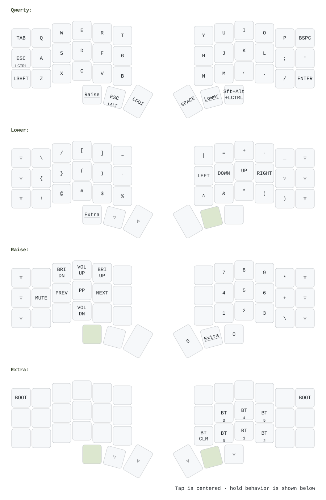

# Corne ZMK configuration

ZMK firmware configuration for a wireless Corne built with nice!nano v2 controllers and nice!view displays.

## Keymap

The diagram below is generated directly from [`config/corne.keymap`](config/corne.keymap), so it reflects the bindings used by the firmware.



### Reading the diagram

- A small label below the main key label is the hold behavior. For example, `ESC` held on the home row acts as `LCTRL`.
- Underlined keys activate the named layer while held.
- `▽` is transparent and falls through to the binding on the next active layer.
- Green keys are held to reach the layer being shown.
- Blank keys are disabled with `&none`.

### Layers

- **Qwerty:** typing layer with home-row `ESC/LCTRL`, thumb modifiers, and Lower/Raise access.
- **Lower:** symbols and arrow keys.
- **Raise:** media controls and a numeric keypad.
- **Extra:** bootloader controls and Bluetooth profile selection/reset.

## Regenerating the diagram

Install [uv](https://docs.astral.sh/uv/), then run:

```sh
./scripts/render-keymap.sh
```

The script pins `keymap-drawer` and regenerates both the intermediate YAML and the README SVG. CI checks that committed diagram files stay in sync with the keymap.
